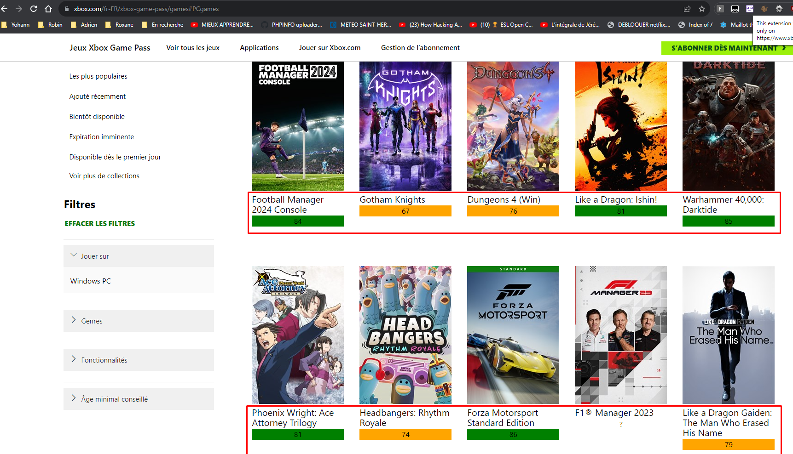

# Chrome-Extension-Base-Template
This is a Chrome Extension to get informations from Metacritic.com and showing the on
https://www.xbox.com/ on the game pass list, with a MIT license.

## Author
Yohann Nizon

## Requirements
Chrome

## Setup Instructions
1. https://www.xbox.com/fr-FR/xbox-game-pass/games
2. Click on the Xbox logo on the plugin
3. View 

## TODO
Automatically add informations without click (with background.js)
